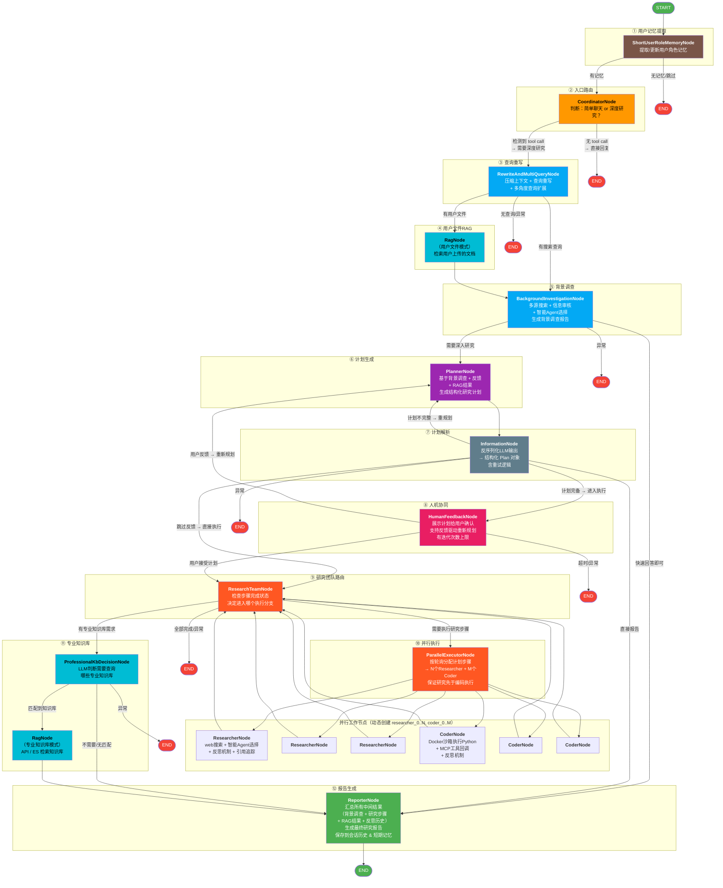

# DeepResearch 管线流转流程图



---

## 关键路由决策汇总

| 节点 | Dispatcher | 路由逻辑 |
|------|-----------|---------|
| short_user_role_memory | ShortUserRoleMemoryDispatcher | 读取 `short_user_role_next_node` 状态值 → coordinator 或 END |
| coordinator | CoordinatorDispatcher | 检测 LLM 响应中是否有 tool call → 有则 rewrite_multi_query，无则 END（直接聊天） |
| rewrite_multi_query | RewriteAndMultiQueryDispatcher | 有 `optimize_queries` → background_investigator；有 `user_upload_file` → user_file_rag |
| background_investigator | BackgroundInvestigationDispatcher | `enable_deepresearch=true` → planner；false → reporter（快速回答） |
| information | InformationDispatcher | Plan 状态完备 → human_feedback 或 research_team；不完整 → planner（重规划循环） |
| human_feedback | HumanFeedbackDispatcher | 用户接受或跳过（`auto_accepted_plan`）→ research_team；用户反馈 → planner |
| research_team | ResearchTeamDispatcher | `use_professional_kb=true` → professional_kb_decision；否则 → parallel_executor |
| professional_kb_decision | ProfessionalKbDispatcher | `selected_knowledge_bases` 非空 → professional_kb_rag；为空 → reporter |

---

## 两条典型路径

### 路径 A：快速回答（不进入深度研究）
```
START → short_user_role_memory → coordinator → END
```
coordinator 判断不需要 tool call，直接聊天回复。

### 路径 B：完整深度研究
```
START → short_user_role_memory → coordinator → rewrite_multi_query
  → background_investigator → planner → information → human_feedback
  → research_team → parallel_executor → researcher_X / coder_X
  → research_team → professional_kb_decision → professional_kb_rag
  → reporter → END
```
